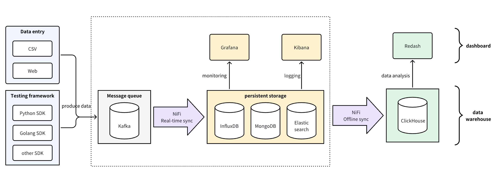
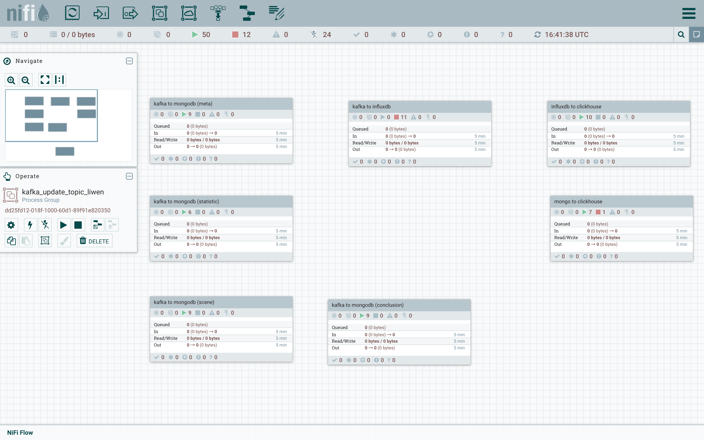
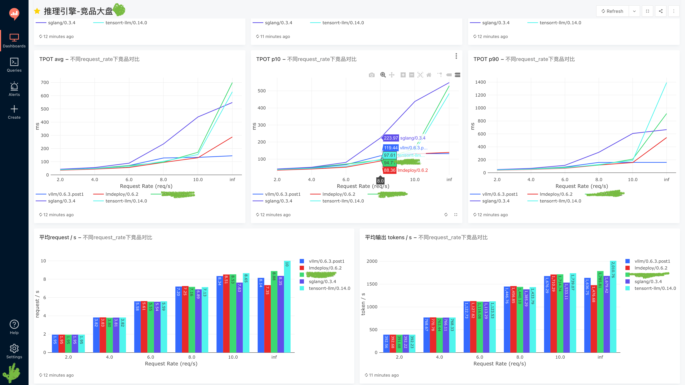
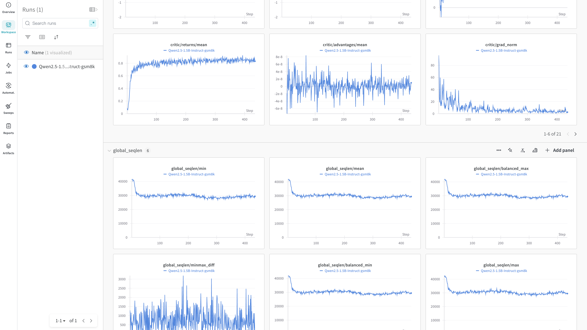

# AI评测数据存储平台

## 项目简介

评测数据存储平台设计的初衷是为了聚合公司内部所有的AI评测数据（性能评测、功能评测、精度评测），同时支持对历史数据的分析与报表展示。该平台使用Redash/wandb作为各类数据的分析与展示端，测试代码可以运行在云服务、本地机房、API、私有部署等各种环境下。

## 核心功能

1. 统一的数据存储和数据展示
2. 通过[Redash](https://github.com/getredash/redash)/[wandb](https://github.com/wandb/wandb)动态展示结果图表
3. 通过Grafana实时监控运行过程
4. 支持测试工具离线同步数据
5. 支持各类数据源的任意组合
6. 使用[NiFi](https://github.com/apache/nifi)串联数据同步流程，Codeless快速实现，维护成本低
7. 易扩展，表结构可以随时调整

## 技术选型

| 技术组件 | 用途说明 |
|---------|---------|
| Kafka | 解耦测试框架和数据存储，使得测试框架可以离线或者异地运行，不用关注数据存储端的逻辑 |
| MongoDB | 非关系型数据库，灵活易扩展，方便后续增加字段、增加测试类型 |
| InfluxDB | 存储测试原始数据，时序数据库，可以动态扩展列维度 |
| Chronograf | InfluxDB配套的仪表盘，安装依赖少，配置更简单 |
| Elasticsearch | 存储日志数据，方便进行日志检索 |
| NiFi | ETL工具，数据提取、转换、加载，按照需求进行配置 |
| ClickHouse | 数据仓库，方便进行各维度的对比和聚合，相较于Hive维护成本低 |
| Redash/wandb | 数据展示端 |

## 部署信息

详细的部署信息参考：[LLM-Eval/data_platform](https://github.com/HowardChenRV/LLM-Eval/tree/main/docker/data_platform)

## 架构图

## 数据展示

更多showcase参考：
- [Redash数据展示](redash_dashboard_showcase.pdf)
- [Wandb数据展示](wandb_dashboard_showcase.pdf)

（部分敏感数据已做打码处理）

## 测试框架

AI评测过程使用的测试框架参考：

1. LLM性能评测：使用[自研框架](https://github.com/HowardChenRV/LLM-Eval)
2. LLM功能测试：使用[自研框架](https://github.com/HowardChenRV/llm_engine_test)
3. LLM精度评测：基于开源的[OpenCompass](https://github.com/open-compass/opencompass)和[lm-evaluation](https://github.com/EleutherAI/lm-evaluation-harness)做二次开发
