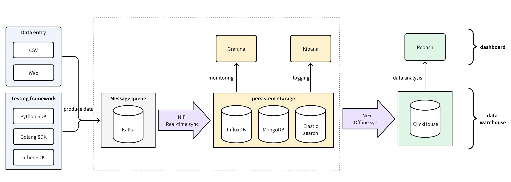
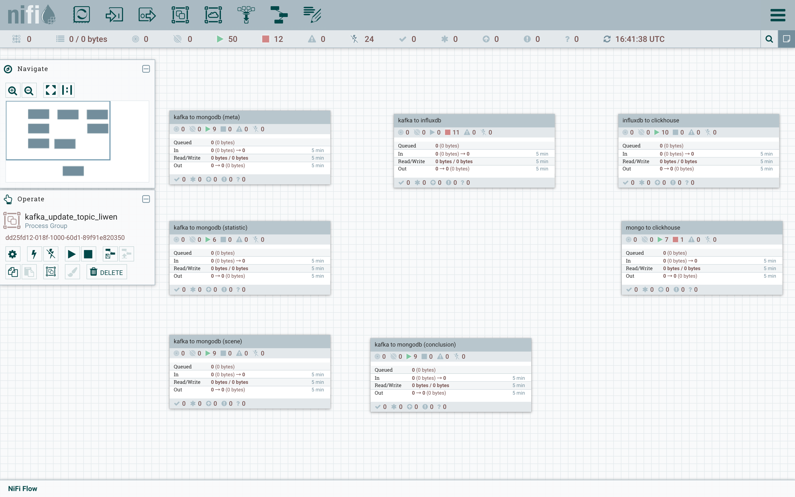
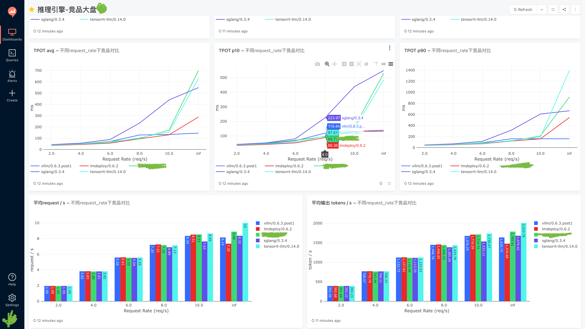
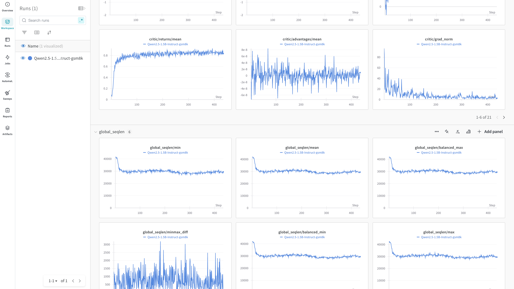

# AI Evaluation Data Platform

## Project Overview

The AI Evaluation Data Platform was designed to aggregate all internal AI evaluation data (performance evaluation, functional evaluation, accuracy evaluation) within the company, while supporting analysis and report presentation of historical data. The platform uses Redash/wandb as the analysis and display endpoint for various types of data. Test codes can run in various environments such as cloud services, on-premises data centers, APIs, and private deployments.

## Core Features

1. Unified data storage and data display
2. Dynamic result chart display through [Redash](https://github.com/getredash/redash)/[wandb](https://github.com/wandb/wandb)
3. Real-time monitoring of the running process through Grafana
4. Support for offline synchronization of test tool data
5. Support for arbitrary combinations of various data sources
6. Using [NiFi](https://github.com/apache/nifi) to connect data synchronization processes, codeless rapid implementation, low maintenance cost
7. Easy to extend, table structure can be adjusted at any time

## Technology Stack

| Technology Component | Usage Description |
|---------------------|-------------------|
| Kafka | Decoupling test frameworks and data storage, allowing test frameworks to run offline or remotely without worrying about the data storage end logic |
| MongoDB | NoSQL database, flexible and scalable, convenient for adding fields and test types later |
| InfluxDB | Storing raw test data, time-series database, can dynamically expand column dimensions |
| Chronograf | Companion to InfluxDB, fewer installation dependencies, simpler configuration |
| Elasticsearch | Storing log data, convenient for log retrieval |
| NiFi | ETL tool for data extraction, transformation, and loading, configurable according to requirements |
| ClickHouse | Data warehouse, convenient for multi-dimensional comparison and aggregation, lower maintenance cost compared to Hive |
| Redash/wandb | Data display endpoint |

## Deployment Information

Detailed deployment information reference: [LLM-Eval/data_platform](https://github.com/HowardChenRV/LLM-Eval/tree/main/docker/data_platform)

## Architecture Diagram

## Data Dashboard

More showcases reference:
- [Redash Dashboard](redash_dashboard_showcase.pdf)
- [Wandb Dashboard](wandb_dashboard_showcase.pdf)

(Some sensitive data has been masked)

## Test Frameworks

Test frameworks used in the AI evaluation process:

1. LLM Performance Evaluation: Using [in-house framework](https://github.com/HowardChenRV/LLM-Eval)
2. LLM Functional Testing: Using [in-house framework](https://github.com/HowardChenRV/llm_engine_test)
3. LLM Accuracy Evaluation: Secondary development based on open-source [OpenCompass](https://github.com/open-compass/opencompass) and [lm-evaluation](https://github.com/EleutherAI/lm-evaluation-harness)