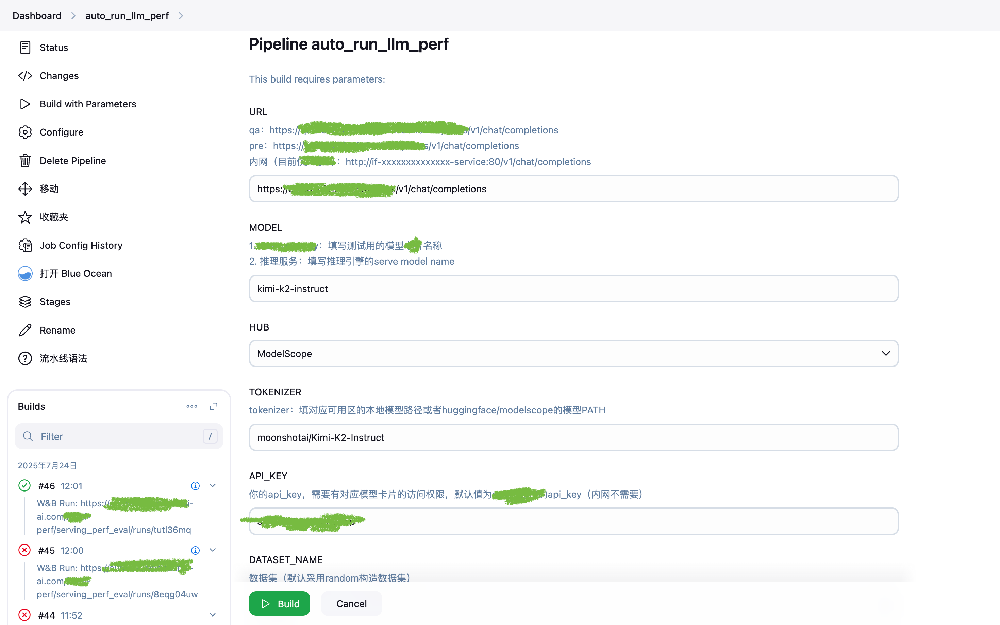

# 自动化测试平台

## 项目简介

该项目旨在搭建自动化pipeline流程串联AI性能、功能、精度测试流程，并上报测试数据至AI数据存储平台。

相关参考：
- [AI数据存储平台中文文档](../AIEvaluationDataPlatform/README.md)
- [AI数据存储平台英文文档](../AIEvaluationDataPlatform/README_EN.md)

该项目使用[Jenkins](https://github.com/jenkinsci/jenkins)搭建，采用jenkins agent模式纳管各类测试Linux服务器、Windows AIPC。

## 架构图

## 样式参考

（部分敏感数据已做打码处理）

## Jenkins Pipeline

## 触发方式

支持以下两种触发方式：
1. Jenkins触发表单手动触发
2. CI自动触发

## 报告通知

