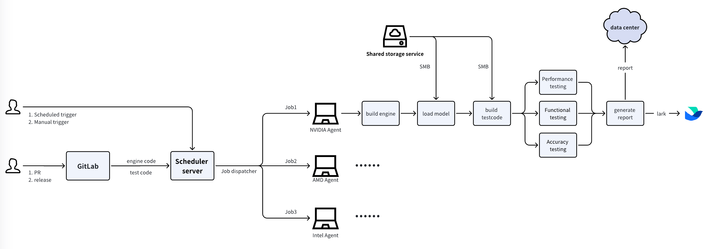
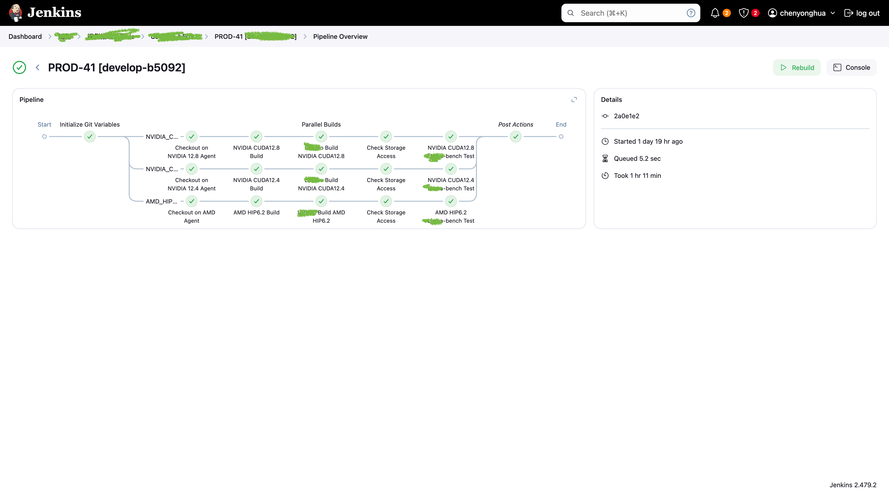
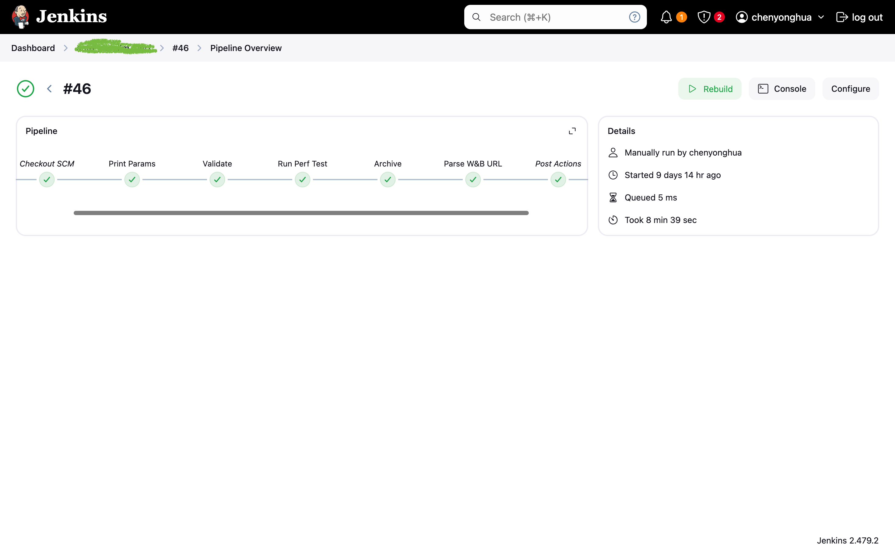
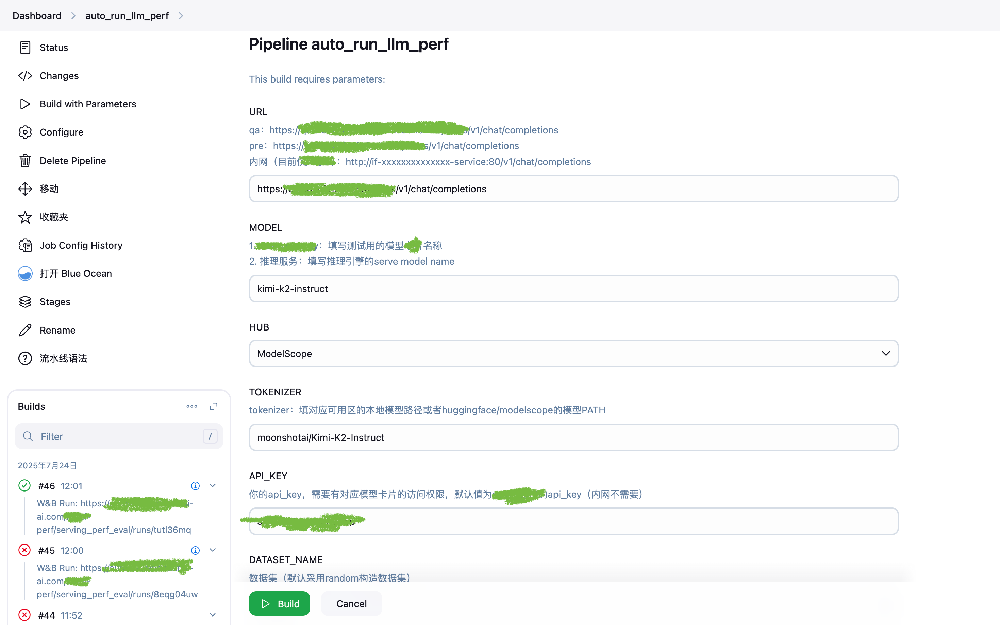
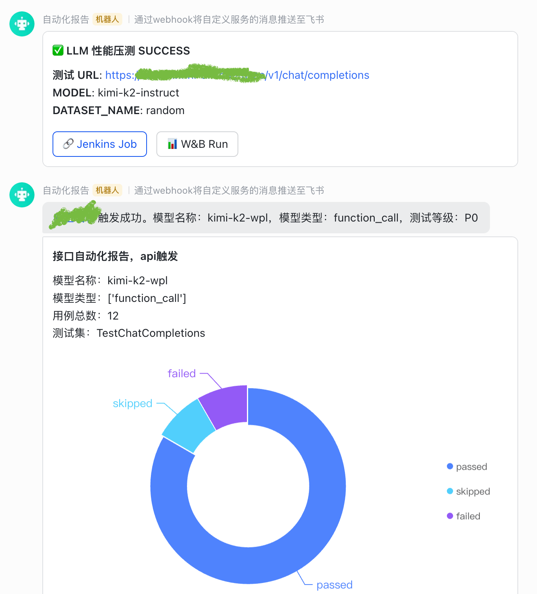

# Automated Testing Platform

## Project Overview

This project aims to build an automated pipeline workflow to connect AI performance, functionality, and accuracy testing processes, and report test data to the AI data storage platform.

Related references:
- [AI数据存储平台中文文档](../AIEvaluationDataPlatform/README.md)
- [AI Data Storage Platform English Documentation](../AIEvaluationDataPlatform/README_EN.md)

The project is built using [Jenkins](https://github.com/jenkinsci/jenkins), adopting the Jenkins agent model to manage various testing Linux servers and Windows AIPC.

## Architecture Diagram

## Style Reference

(Some sensitive data has been masked)

## Jenkins Pipeline

## Trigger Methods

Supports the following two triggering methods:
1. Manual trigger via Jenkins trigger form
2. Automatic trigger via CI

## Report Notifications

