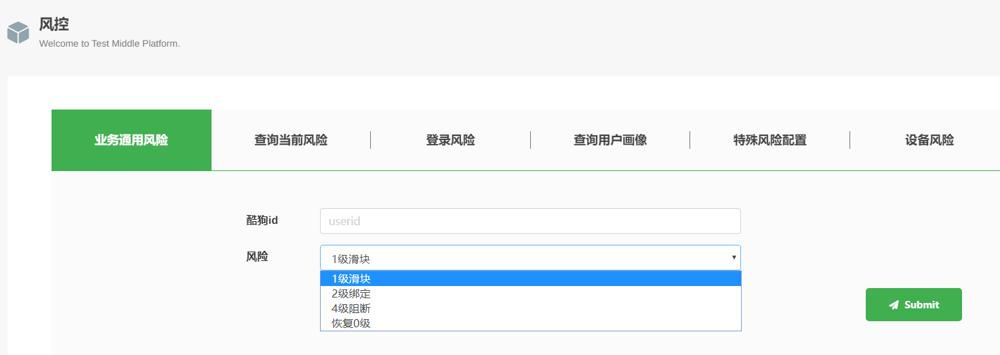

# 测试工具中台

## 项目简介

测试工具中台是我们公司一款基于业务特性的测试工具集成 Web 平台。开发的目的在于解决团队内测试工具分布零散、数据构造复杂、人为造数耗时、工具跨团队复用困难等痛点。

## 核心功能

1. **业务数据构造**：涵盖风控、用户画像、会员、金币、广告等功能的批量造数
2. **数据查询**：媒资/音乐人查询、曲库搜索
3. **财务报销处理**：测试预付款财务报销处理
4. **测试平台相关管理功能**：账号管理、权限管理、操作记录、数据图表统计、日志定位等

## 技术栈

- **后端技术**：Linux/Nginx/Redis/Mysql/Python/Flask/Docker
- **前端技术**：HTML/CSS/Bootstrap/JavaScript/jQuery

## 项目成果

- 负责平台整体架构设计
- 承担项目前端开发(60%)，后端开发，部署，维护(80%)
- 完成部门多个业务线接入，测试成本降低40%
- 部分 Web UI showcase 参考该目录下其他图片（部分敏感内容已做打码处理）

## UI 展示

