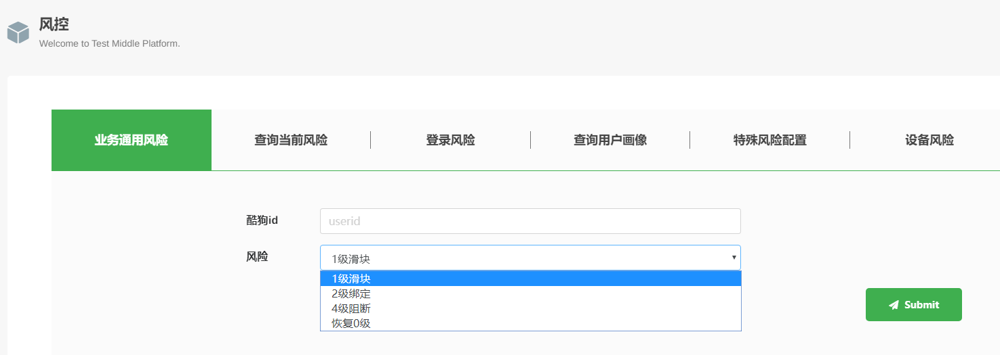
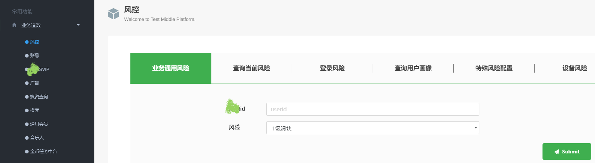

# Test Tools Platform

## Project Overview

Test Tools Platform is a business-oriented integrated testing tool web platform developed for our company. It was created to address pain points such as scattered distribution of testing tools within the team, complex data construction, time-consuming manual data creation, and difficulties in cross-team tool reuse.

## Core Features

1. **Business Data Generation**: Batch data creation covering risk control, user profiling, membership, coins, advertising, and other functions
2. **Data Query**: Media asset/musician query, music library search
3. **Financial Reimbursement Processing**: Handling of test advance payment financial reimbursements
4. **Test Platform Management Functions**: Account management, permission management, operation logs, chart statistics, log positioning, etc.

## Technology Stack

- **Backend Technologies**: Linux/Nginx/Redis/Mysql/Python/Flask/Docker
- **Frontend Technologies**: HTML/CSS/Bootstrap/JavaScript/jQuery

## Project Achievements

- Responsible for overall platform architecture design
- Handled 60% of frontend development and 80% of backend development, deployment, and maintenance
- Successfully integrated multiple business lines within the department, reducing testing costs by 40%
- Refer to other images in this directory for Web UI showcases (some sensitive content has been masked)

## UI Showcase

